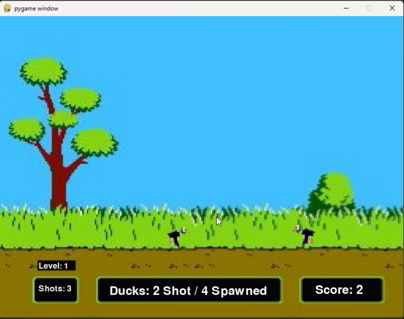

# 🦆 Duck Hunt — Physics-Based Shooting Game

A remake of the classic Duck Hunt game with physics-based movement using **Box2D** and **Pygame**. Ducks fly with forces, a dog retrieves shot birds, and you can even drop a nuke! The game progresses in levels, gets harder, and ends if too many ducks escape.

## 🎮 Features

- 🔫 Click to shoot ducks mid-flight  
- 🐕 Animated dog retrieves shot ducks  
- 💣 Use the nuke with the spacebar to end the game dramatically  
- 📈 Level progression with increasing difficulty  
- 💀 Ducks collide and die  

---

## 🛠️ Technologies Used

- Python 3.11
- [Pygame](https://www.pygame.org/) (for rendering, input, and game loop)
- [PyBox2D](https://github.com/pybox2d/pybox2d) (for physics simulation)

---
## 🖼️ Demo Screenshots




---

## 💻 How to run

In the duckhunt directory run:
```python
python duckhunt.py
```
## 🎮 Controls
- Key / Mouse - Action
- Mouse Click - Shoot a duck (max 3 shots)
- R - Restart after Game Over
- SPACE- Drop the nuke
- Window Close -	Exit the game

## 🔍 Gameplay Mechanics
- Ducks spawn and fly using Box2D physics.
- You have 3 shots per duck attempt.
- Shooting a duck spawns the dog to retrieve it.
- 2 escaped ducks = Game Over.
- Level increases every 5 ducks.